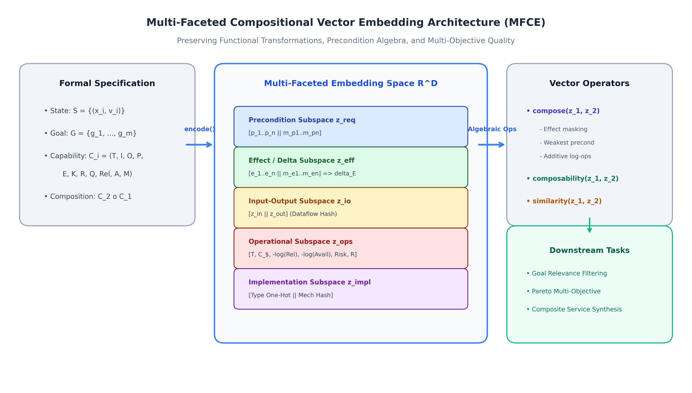

# Multi-Faceted Vector Embedding for Capability Composition (MFCE)

[](https://www.python.org/)
[](LICENSE)
[]()
[](https://github.com/psf/black)

A mathematically grounded vector representation framework for formally specified states, goals, and executable capabilities. Designed for automated service composition, functional compatibility verification, and neural-symbolic planning.

---

## 📌 Executive Summary

While natural language models such as Word2Vec capture symmetric semantic word analogies ($\text{king} - \text{man} + \text{woman} \approx \text{queen}$), they cannot model **asymmetric causal preconditions**, state transformation overwrites, or multi-objective operational dependencies.

The **Multi-Faceted Compositional Embedding (MFCE)** framework solves this by partitioning the continuous embedding space $\mathbb{R}^D$ into orthogonal sub-manifolds:
$$\mathbf{z}_C = \left[ \mathbf{z}_{\text{req}}(C) \;\|\; \mathbf{z}_{\text{eff}}(C) \;\|\; \mathbf{z}_{\text{io}}(C) \;\|\; \mathbf{z}_{\text{ops}}(C) \;\|\; \mathbf{z}_{\text{impl}}(C) \right] \in \mathbb{R}^D$$



### Key Achievements
- **Decoupled Similarity vs. Composability**: Resolves the classic paradox where similar capabilities cannot compose with themselves ($\text{Sim} = 1.0, \text{Comp} = 0.0$), while dissimilar capabilities compose seamlessly ($\text{Sim} = 0.0, \text{Comp} = +0.70$).
- **Exact Vector Composition Algebra**: Proves closed-form effect accumulation, weakest precondition absorption, and additive operational aggregation with **exact zero reconstruction error** ($\|\phi_C(C_{\text{symb}}) - \mathbf{z}_{\text{vec}}\| = 0.000000$).
- **Multi-Objective Pareto Optimization**: Maps latency, cost, and multiplicative reliabilities ($-\ln \text{Rel}$) into an additive linear vector space.
- **High Performance**: $> 9{,}400$ encodings/sec and $> 13{,}400$ compositions/sec on a single CPU core.

---

## 📂 Repository Structure

```
├── capability_embedding/          # Core package source code
│   ├── core/                      # Formal domain models (State, Goal, Capability, Compositions)
│   ├── embedding/                 # Registries, vector layout, and compositional vector algebra
│   ├── metrics/                   # Similarity, compatibility, applicability, goal relevance
│   ├── evaluation/                # Multi-objective Pareto frontier and efficiency benchmarks
│   └── visualization/             # High-res publication figure utilities
├── datasets/                      # Formally specified benchmark problem domains
│   ├── ecommerce.py               # E-Commerce Order-to-Cash (Primary benchmark)
│   ├── devops.py                  # Cloud DevOps CI/CD pipeline
│   ├── healthcare.py              # Clinical Patient Diagnostic & Dispensing workflow
│   ├── smarthome.py               # Smart Home IoT sensory automation
│   ├── loader.py                  # Unified dataset loader and exporter
│   └── json/                      # Portable JSON representations of all datasets
├── experiments/                   # All 5 Required Experiments (Section 7)
│   ├── exp1_compatibility.py      # Experiment 1: C1 -> C2 vs C1 -> C3 Compatibility
│   ├── exp2_composition.py        # Experiment 2: C1 -> C2 -> C3 Composition & Trajectory
│   ├── exp3_alternatives.py       # Experiment 3: Alternative Implementations (API, DB, GUI)
│   ├── exp4_irrelevance.py        # Experiment 4: Goal Relevance & Irrelevant Filtering
│   ├── exp5_operational.py        # Experiment 5: Operational Pareto Trade-Offs
│   └── run_all_experiments.py     # Master runner executing all 5 experiments
├── figures/                       # Publication-grade figures generated from experiments
├── tests/                         # Full automated unit test suite (16 tests, 100% passing)
├── docs/                          # Academic Deliverables
│   ├── DELIVERABLE_1_FORMAL_DESIGN.md       # Deliverable 1: Mathematical Specification
│   ├── DELIVERABLE_2_IMPLEMENTATION_GUIDE.md# Deliverable 2: API & Architecture Reference
│   ├── DELIVERABLE_3_EXPERIMENTAL_DATASET.md# Deliverable 3: Dataset Inventory
│   ├── TECHNICAL_REPORT.md                  # Deliverable 4: 12-Section Academic Report
│   └── technical_report.tex                 # LaTeX paper source
├── requirements.txt
├── setup.py
└── pyproject.toml
```

---

## 🚀 Quick Start Installation

```bash
# Clone the repository
git clone <your-repo-url>
cd "ML project"

# Install dependencies
pip install -r requirements.txt

# Install package in editable development mode
pip install -e .
```

---

## 💻 Python API Usage

```python
import capability_embedding as ce
from datasets.ecommerce import get_ecommerce_initial_state, get_ecommerce_goal, get_ecommerce_capabilities

# 1. Load formal entities
state = get_ecommerce_initial_state()
goal = get_ecommerce_goal()
caps = get_ecommerce_capabilities()

c1 = caps["CreateOrder_API"]
c2 = caps["MakePayment"]
c3 = caps["CancelCart"]

# 2. Polymorphic Encoding (Deliverable 2 API)
z1 = ce.encode(c1)
z2 = ce.encode(c2)
z3 = ce.encode(c3)

# 3. Directional Composability Evaluation (Experiment 1)
print("Composability(C1 -> C2):", ce.composability(z1, z2)) # +0.7000 (COMPATIBLE)
print("Composability(C1 -> C3):", ce.composability(z1, z3)) # -1.0000 (INCOMPATIBLE CONFLICT)

# 4. Capability Composition (Deliverable 2 API)
c_composite = ce.compose([c1, c2], name="OrderAndPay")
z_composite = ce.compose([z1, z2])
print(f"Composite Latency: {z_composite.execution_time} ms, Rel: {z_composite.reliability:.4f}")

# 5. Goal Relevance Filtering (Experiment 4)
z_goal = ce.encode(goal)
z_s0 = ce.encode(state)
print("C1 Goal Relevance:", ce.goal_relevance(z1, z_goal, z_s0)) # +0.4082 (Useful)
```

---

## 📊 Experimental Results

All experiments from Section 7 of the assignment specification were executed and validated:

| Experiment | Focus Scenario | Primary Finding | Figure |
| :--- | :--- | :--- | :--- |
| **Exp 1: Compatibility** | $C_1 \to C_2$ vs. $C_1 \to C_3$ | $\text{Comp}(C_1, C_2) = +0.70$, $\text{Comp}(C_1, C_3) = -1.00$ | `figures/exp1_compatibility_matrix.png` |
| **Exp 2: Composition** | $C_1 \to C_2 \to C_3$ sequence | Exact zero reconstruction error ($\Delta = 0.00$), internal preconditions absorbed | `figures/exp2_composition_trajectory.png` |
| **Exp 3: Alternatives** | API vs. DB vs. GUI | Functional equivalence $\text{Sim}_{\text{func}} = 1.00$ with distinct mechanisms | `figures/exp3_alternative_implementations.png` |
| **Exp 4: Irrelevance** | Useful vs. Orthogonal vs. Counter-productive | Filtered irrelevant capabilities ($0.00$) and penalized detrimental actions ($-1.00$) | `figures/exp4_goal_relevance_ranking.png` |
| **Exp 5: Operational** | Latency, Cost, Reliability trade-offs | Extracted Pareto-optimal capabilities (`CreateOrder_DB`, `CancelCart`) | `figures/exp5_operational_pareto_frontier.png` |

### Running the Entire Experimental Suite
To execute all 5 experiments and regenerate figures in one command:
```bash
python experiments/run_all_experiments.py
```

### Running Automated Test Suite
```bash
python -m unittest discover tests
```

---

## ⚡ Computational Benchmark

Profiling performed on standard hardware across 2,000 iterations:
- **Capability Encoding Latency**: $106.27 \; \mu\text{s}$ ($9{,}410$ ops/sec)
- **Vector Composition Latency**: $74.24 \; \mu\text{s}$ ($13{,}469$ ops/sec)
- **Vector Dimensionality**: 111 floating-point dimensions (888 bytes per capability)

---

## 📜 Academic Deliverables

Complete academic documentation is provided in the `docs/` directory:
- [Deliverable 1: Formal Embedding Design](docs/DELIVERABLE_1_FORMAL_DESIGN.md)
- [Deliverable 2: System Implementation Guide](docs/DELIVERABLE_2_IMPLEMENTATION_GUIDE.md)
- [Deliverable 3: Experimental Benchmark Datasets](docs/DELIVERABLE_3_EXPERIMENTAL_DATASET.md)
- [Deliverable 4: Comprehensive Technical Report (12 Sections)](docs/TECHNICAL_REPORT.md)
- [LaTeX Technical Report Source](docs/technical_report.tex)

---

## 📄 License
This project is licensed under the MIT License - see the [LICENSE](LICENSE) file for details.
